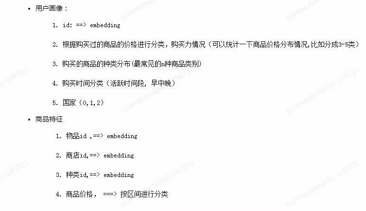

# @Qiccc features

# @renz features

## 用户特征

对于每个用户:

1.
  - 用户购买商品的次数
  - 用户购买商品中 流行/非流行 商品数,及其占比(占总购买次数)
  - ~~用户对热销品的购买欲望(按热销品占比)~~
  - 用户购买商品价格的最大值\最小值\平均值\中值
  - 用户购买 流行/非流行 商品中价格的最大值\最小值\平均值\中值
  
  - **用户购买冲动: 根据购买次数对用户进行划分**
  - **用户消费能力: 根据购买商品价格(中值)对用户进行划分**
  
2.
  - 用户购买商品类别数量
  - 用户购买商品类别中流行类别数,及其占比
  - 用户在各 流行/非流行 商品类别中购买商品的平均数量\中值数量\最大数量\最小数量(类别太多,以是否流行类别来计算)
  - 用户在各 流行/非流行 商品类别中购买商品价格的最大值\最小值\平均值\中直

        **商品类别是否流行按品类交易量划分**

3.  
  - 用户购买过的商户的数量
  - 用户购买过的商户中流行商户数,及其占比
  - 用户在各 流行/非流行 商户中购买商品的平均数量\中值数量\最大数量\最小数量(商户太多,以是否流行商户来计算)
  - 用户在各 流行/非流行 商户中购买商品价格的最大值\最小值\平均值\中直
  
        **商户是否流行按店铺交易量划分**

4.
  - 用户在白天购买次数\夜晚购买次数\深夜购买次数
    - 白天\夜晚\深夜 购买 流行/非流行 商品数量,及其占比
    - 白天\夜晚\深夜 购买商品的 最大\最小\平均\中直
    - 白天\夜晚\深夜 购买 流行/非流行 商品中价格的最大值\最小值\平均值\中直

  - 用户在白天购买品类数\夜晚购买品类数\深夜购买品类数
    - 白天\夜晚\深夜 购买 流行/非流行 商品类别数量,及其占比
    - 白天\夜晚\深夜 在各 流行/非流行 商品类别中购买商品的平均数量\中直数量\最大数量\最小数类
    - 白天\夜晚\深夜 在各 流行/非流行 商品类别中购买商品价格的最大值\最小值\平均值\中直

  - 用户在白天购买商户数\夜晚购买商户数\深夜购买商户数
    - 白天\夜晚\深夜 购买 流行/非流行 商户数量,及其占比
    - 白天\夜晚\深夜 在各 流行/非流行 商户中购买商品的平均数量\中直数量\最大数量\最小数类
    - 白天\夜晚\深夜 在各 流行/非流行 商户中购买商品价格的最大值\最小值\平均值\中直
  
  - 用户在工作日\周末 购买次数
  
    ......同上
  
  以上特征待分析

**PS1**:可将流程度分成3级(栗子:卖的最多1级, 次2级, 长尾3级, 则1级与2级都属于流行)

## 商品特征
  

1.
  - 商品价格
  - 商品所属 流行商品 级别(参考PS1)
  - 商品价格定位(根据所有商品价格? 根据流行商品价格?)

2.
  - 商品所属 流行商品类别(品类) 级别
  - 商品在所属 品类 级别中销售数量,及其占比

3.
  - 商品总售出次数
  - 商品是否在流行商户有售(级别1与级别2)
  - 商品在几家商户中有售,占所有商户的比重
  - 商品在各 流行度级别 的商户的销售数量,及其占比

4.
  - 商品是否属于网站主营商品(按商品销售量划分)
  - 商品是否属于网站主营类别(按cate_id销售量划分)
  - 商品是否属于流行商户主营商品(按流行商户出售商品数量划分)
  - 商品是否属于流行商户主营类别(按流行商户的cate_id销售量划分)
  -  
  - 

## 商户特征
  1. 店铺下商品数量

  2. 店铺下品类数量

  3. 

